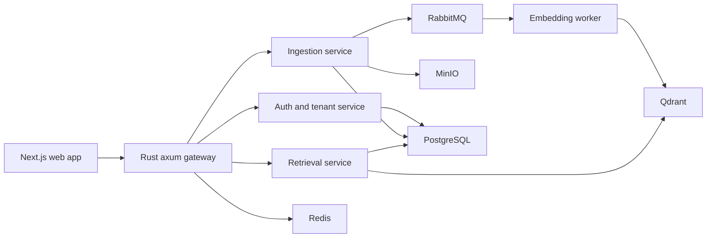

# Grounded

Self-hostable, multi-tenant RAG platform that answers questions from documents with cited sources.

Grounded is intentionally shaped as a microservice system from the start: a Next.js product surface, a Rust gateway on the external hot path, and Python services where the ML and document-processing ecosystem matters. Kubernetes, Terraform, GitOps, and full observability are later layers. The first milestone is a runnable system with real service boundaries.

## Architecture



## Service Boundaries

| Path | Runtime | Responsibility |
| --- | --- | --- |
| `apps/web` | Next.js | Landing, auth pages, workspace UI, document workflow, future backend integration |
| `apps/gateway` | Rust, axum | Public API, health aggregation, routing, future auth/rate-limit/SSE proxy |
| `services/auth` | Python, FastAPI | Tenants, users, organizations, API keys, RBAC |
| `services/ingestion` | Python, FastAPI | Document intake, metadata, parsing orchestration, queue handoff |
| `services/embedding` | Python worker | Async chunk embedding and vector indexing |
| `services/retrieval` | Python, FastAPI | Question answering contract, future hybrid search, reranking, generation, citations |
| `packages/database` | Prisma | PostgreSQL schema, migrations, and generated database contract |
| `packages/contracts` | OpenAPI | Public API contract surface |
| `infra/docker` | Docker Compose | Local microservice runtime |

## Authentication And API Security

The backend now uses an auth-first request model. Users register into a tenant, verify email before login, authenticate through short-lived access tokens, and keep sessions alive through rotating refresh tokens. Refresh token reuse revokes the whole token family.

Protected document and question APIs require `Authorization: Bearer $ACCESS_TOKEN`. Auth state is backed by Prisma-managed PostgreSQL tables for user sessions, refresh tokens, verification tokens, password reset tokens, and audit events.

Implemented auth flows:

| Flow | Endpoint |
| --- | --- |
| Register | `POST /api/auth/register` |
| Verify email | `POST /api/auth/email/verify` |
| Login | `POST /api/auth/login` |
| Refresh session | `POST /api/auth/refresh` |
| Logout current session | `POST /api/auth/logout` |
| Logout all sessions | `POST /api/auth/logout-all` |
| Forgot password | `POST /api/auth/password/forgot` |
| Reset password | `POST /api/auth/password/reset` |
| Change password | `POST /api/auth/password/change` |
| List sessions | `GET /api/auth/sessions` |
| Revoke session | `DELETE /api/auth/sessions/{session_id}` |

The detailed auth specification is in `docs/auth-security.md`.

## Local Runtime

```bash
docker compose -f infra/docker/docker-compose.yml up --build
```

Default endpoints:

| Service | URL |
| --- | --- |
| Web | `http://localhost:3000` |
| Gateway | `http://localhost:8080/health` |
| Auth | `http://localhost:8001/health` |
| Ingestion | `http://localhost:8002/health` |
| Retrieval | `http://localhost:8004/health` |
| Qdrant | `http://localhost:6333` |
| RabbitMQ management | `http://localhost:15672` |
| MinIO console | `http://localhost:9001` |

Run the backend smoke test after the stack is up and database migrations are applied:

```bash
npm run smoke:backend
```

## Database

Prisma is used as the PostgreSQL schema and migration layer.

```bash
npm install
npm run db:validate
npm run db:generate
npm run db:migrate
```

The schema lives in `packages/database/prisma/schema.prisma`. The initial migration lives in `packages/database/prisma/migrations/0001_initial_schema`.

Engineering notes are in `docs/database.md`, `docs/backend-architecture.md`, `docs/ingestion-pipeline.md`, and `docs/retrieval-pipeline.md`.

## Engineering Rules

Grounded is not using informal code standards. Read these before contributing:

| Document | Purpose |
| --- | --- |
| `CONTRIBUTING.md` | Branches, commits, pull requests, required checks, and review rules |
| `CONTRIBUTORS.md` | Maintainer roles, area ownership, and contributor expectations |
| `CODE_STYLE.md` | Code style, service boundaries, no-comment policy, dependency rules |
| `SECURITY.md` | Tenant isolation, secrets, vulnerability reporting, security review triggers |
| `CODE_OF_CONDUCT.md` | Collaboration and review conduct |
| `docs/development-workflow.md` | Definition of ready, definition of done, verification matrix |

Non-trivial work must update the matching document in `docs/`. API changes update `docs/api-contracts.md`. Schema changes update `docs/database.md`. Tenant isolation changes update `docs/tenant-isolation.md`.

## API Shape

Queue a document:

```bash
curl -X POST http://localhost:8080/api/documents \
  -H "Authorization: Bearer $ACCESS_TOKEN" \
  -H "Content-Type: application/json" \
  -d '{"filename":"contract.md","title":"Contract","content_type":"text/markdown","content":"# Contract\nTermination requires 30 days notice."}'
```

List documents:

```bash
curl http://localhost:8080/api/documents \
  -H "Authorization: Bearer $ACCESS_TOKEN"
```

Ask a question:

```bash
curl -X POST http://localhost:8080/api/questions \
  -H "Authorization: Bearer $ACCESS_TOKEN" \
  -H "Content-Type: application/json" \
  -d '{"question":"What does this contract say about termination?"}'
```

## Roadmap

1. Add Qdrant vector writes to the embedding worker.
2. Implement retrieval with tenant-scoped hybrid search, reranking, answer streaming, and citation verification.
3. Wire the frontend workspace to the gateway document and retrieval APIs.
4. Add integration tests for cross-tenant isolation and the upload-to-indexed path.
5. Add Kubernetes manifests, Helm charts, Terraform modules, OpenTelemetry, Grafana dashboards, and deployment automation after the local system proves the service boundaries.
