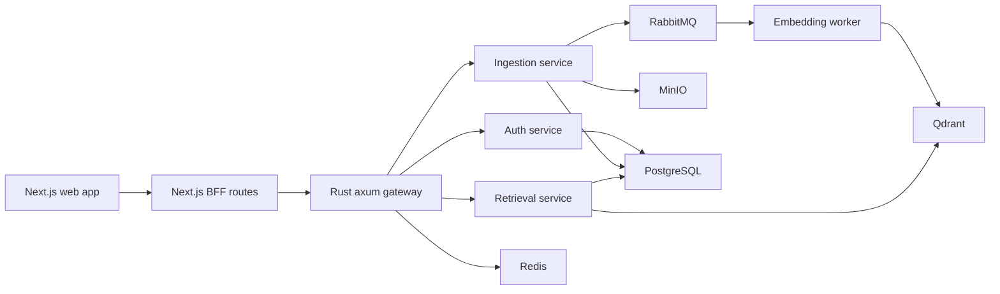

# Grounded

Source-grounded AI workspace for document ingestion, retrieval, citations, and trusted answers.

Grounded is built around one product promise: no source, no answer. Users upload real source text, the system indexes it, and every answer returns citations that can be inspected back to the document evidence.


## Core Workflow

```text
Upload source text
  -> Queue ingestion
  -> Chunk and embed
  -> Index vectors in Qdrant
  -> Ask a tenant-scoped question
  -> Return an answer with citations
  -> Inspect source evidence
```

The current product flow is intentionally narrow. It does not rely on demo fixtures or fake analytics. A new workspace starts empty, asks for one source, then unlocks citation-backed questions after indexing.

## Why This Exists

Most AI document tools make trust feel like a UI label. Grounded treats trust as a system constraint:

- Questions run inside tenant context.
- Retrieval is filtered by tenant before evidence is used.
- Answers are generated from retrieved chunks.
- Citations are persisted with assistant messages.
- Provider readiness is visible in the dashboard.
- Re-indexing is a first-class workflow when embedding configuration changes.

## Product Surface

| Area | Purpose |
| --- | --- |
| Landing | Product positioning, legal links, consent controls |
| Auth | Register, verify email, log in, httpOnly browser session |
| Chat | Ask questions only after indexed evidence exists |
| Documents | Upload source text, filter documents, inspect ingestion jobs, retry, re-index, delete |
| Usage | Real readiness and ingestion status, not fake metrics |
| Settings | Tenant, session, provider, vector index configuration |

## Product Proof


## Architecture



## Service Boundaries

| Path | Runtime | Responsibility |
| --- | --- | --- |
| `apps/web` | Next.js | Landing, auth, workspace UI, BFF routes, protected browser session |
| `apps/gateway` | Rust, axum | Public API routing, service boundary, gateway health |
| `services/auth` | Python, FastAPI | Users, tenants, sessions, email verification, password flows |
| `services/ingestion` | Python, FastAPI | Document intake, versions, jobs, object storage, queue handoff |
| `services/embedding` | Python worker | Chunking, embedding provider selection, Qdrant indexing |
| `services/retrieval` | Python, FastAPI | Tenant-scoped search, answer generation, citations, provider status |
| `packages/database` | Prisma | PostgreSQL schema, migrations, generated database contract |
| `infra/docker` | Docker Compose | Local Postgres, Redis, RabbitMQ, MinIO, Qdrant, services |

## Provider Modes

Grounded runs locally without a paid AI API by default.

| Mode | Use |
| --- | --- |
| `local` | Deterministic local embeddings and extractive answers for development |
| `openai` | Hosted embedding and answer providers through OpenAI-compatible endpoints |
| `ollama` | Local model runtime through Ollama |

Provider configuration is validated at service startup. The dashboard exposes provider readiness so a broken key or missing local model is visible before the user trusts the system.

## Local Setup

Install dependencies:

```bash
npm install
```

Start the full local development loop:

```bash
npm run dev
```

Backend-only flow:

```bash
npm run dev:backend
npm run db:migrate
npm run smoke:backend
```

The backend smoke test registers a real tenant, verifies email through the development token, uploads a real document, waits for indexing, re-indexes it, asks a question, and asserts that citations are returned.

## Verification

```bash
npm run check
npm run smoke:backend
```

`npm run check` validates Prisma, compiles Python services, checks the Rust gateway, lints the web app, and builds Next.js.

`npm run smoke:backend` verifies the end-to-end RAG path against the running local stack.

## Environment

Copy `.env.example` when you want to override defaults:

```bash
cp .env.example .env
```

Important provider variables:

| Variable | Default | Purpose |
| --- | --- | --- |
| `EMBEDDING_PROVIDER` | `local` | `local`, `openai`, or `ollama` |
| `EMBEDDING_MODEL` | `local-hash-v1` | Embedding model name |
| `EMBEDDING_DIMENSIONS` | `64` | Qdrant vector size |
| `ANSWER_PROVIDER` | `local` | `local`, `openai`, or `ollama` |
| `ANSWER_MODEL` | `local-extractive-v1` | Answer model name |
| `OPENAI_API_KEY` | empty | Required for OpenAI provider mode |
| `OLLAMA_BASE_URL` | `http://host.docker.internal:11434` | Ollama endpoint from Docker |

Changing embedding provider, model, or dimensions requires re-indexing documents into a compatible Qdrant collection.

## Documentation

| Document | Purpose |
| --- | --- |
| `docs/case-study.md` | Portfolio case study and product story |
| `docs/auth-security.md` | Authentication, session, and token design |
| `docs/ingestion-pipeline.md` | Upload, storage, jobs, queue, worker handoff |
| `docs/retrieval-pipeline.md` | Retrieval, providers, citations, usage requirements |
| `docs/tenant-isolation.md` | Tenant isolation requirements |
| `docs/development-workflow.md` | Definition of ready, done, and verification |

## Current Status

Implemented:

- Protected BFF auth with httpOnly cookies.
- Tenant-scoped document upload and indexing.
- Embedding worker with local, OpenAI, and Ollama provider modes.
- Retrieval API with citation persistence.
- Provider status endpoint and dashboard readiness UI.
- Document retry and re-index workflow.
- Clean local setup with Prisma migrations and backend smoke verification.

Next highest-impact work:

- Deployment story for a public demo environment.
- Screenshot or short product video for the case study.
- More complete usage ledger once token accounting is production-grade.
- Stronger automated browser tests for the protected workspace flow.
