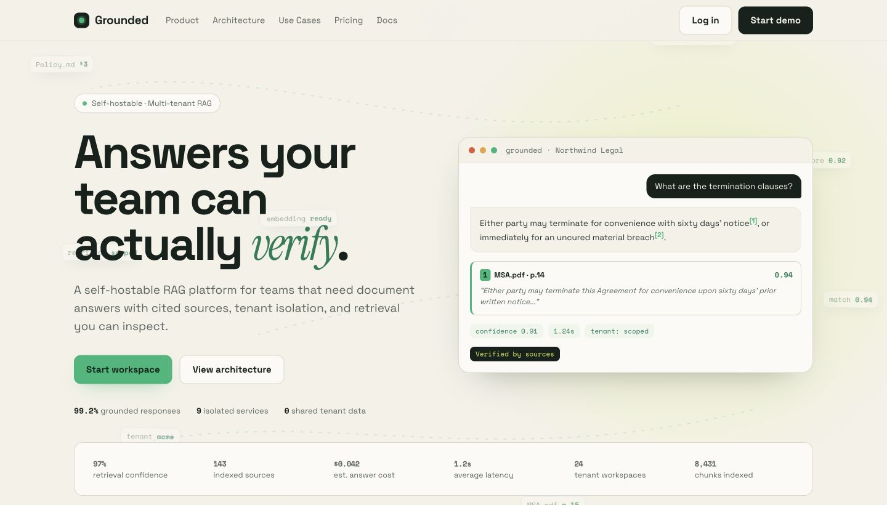
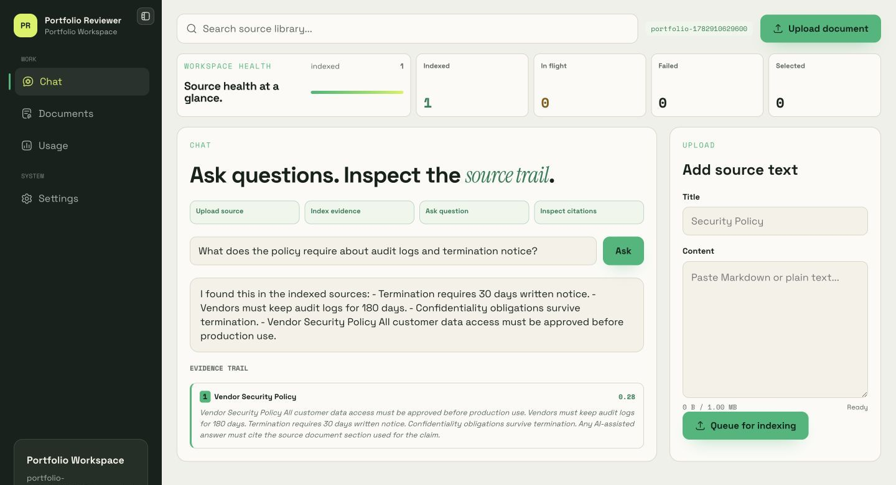
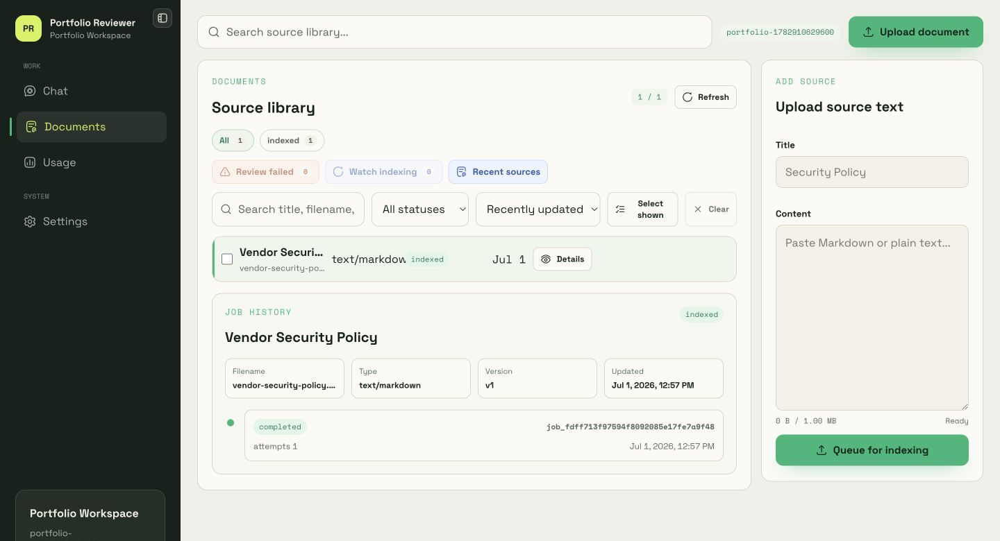
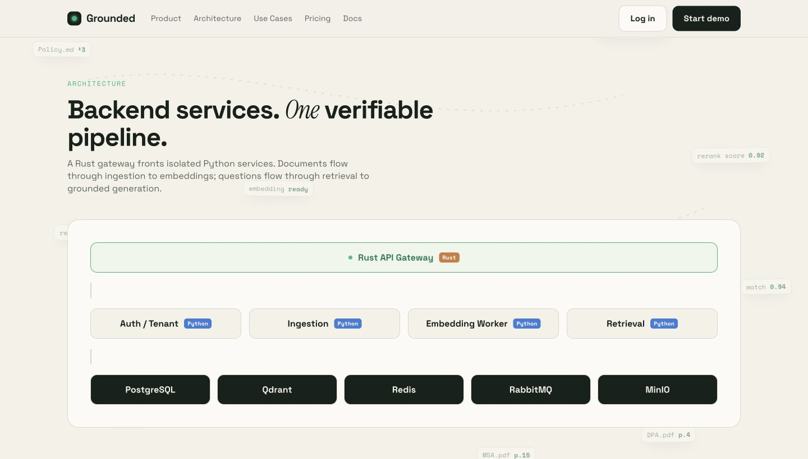
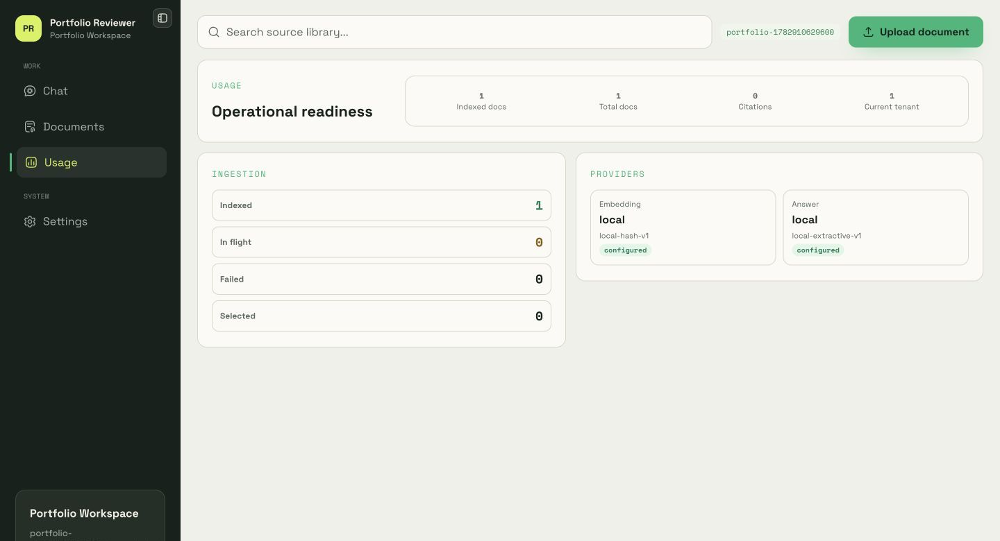

# Grounded Case Study

Grounded is a source-grounded AI workspace for teams that need answers they can verify. It turns uploaded source text into tenant-scoped retrieval, cited answers, and inspectable ingestion history.



## Problem

AI answers are easy to generate and hard to trust. The weak version of this product would be a chat box with a citation-looking UI. That is not enough.

The hard requirement is operational: the system must know which tenant owns the data, which source chunks were retrieved, which provider generated the answer, and whether indexing is actually healthy before a user asks a question.

## Product Decision

Grounded starts with a narrow workflow:

```text
Upload source
  -> Index evidence
  -> Ask question
  -> Inspect citations
```

The workspace does not show fake demo documents by default. An empty tenant stays empty and pushes the user toward the first useful action: upload source text. That keeps the product honest and makes the demo prove the real ingestion path.



## Core Experience

| Step | User sees | System does |
| --- | --- | --- |
| Upload source | Source title and text form | Stores document metadata, version, and source object |
| Queue ingestion | Status moves to queued or processing | Creates ingestion job and publishes to RabbitMQ |
| Index evidence | Job timeline updates | Worker chunks text, embeds chunks, writes vectors to Qdrant |
| Ask question | Chat unlocks after indexed evidence | Retrieval embeds the question and searches tenant-filtered vectors |
| Inspect citations | Answer includes source cards | Citations persist with assistant message records |
| Re-index | Document action queues new indexing job | Latest document version is reprocessed with current provider config |



## Architecture

Grounded uses service boundaries because the product has different failure modes:

- Web and BFF protect browser auth and keep tokens out of browser JavaScript.
- Gateway is the public API edge and service router.
- Auth owns users, tenants, sessions, verification, and password flows.
- Ingestion owns document versions, jobs, storage, and queue handoff.
- Embedding worker owns chunking, embedding provider selection, and vector writes.
- Retrieval owns tenant-scoped search, answer generation, citations, and provider status.
- PostgreSQL stores source metadata, messages, citations, sessions, jobs, and usage records.
- Qdrant stores retrieval vectors.
- RabbitMQ decouples upload latency from indexing work.
- MinIO stores source objects for local development.



## Trust And Safety Choices

| Decision | Why it matters |
| --- | --- |
| httpOnly auth cookies in the web app | Browser JavaScript does not handle access or refresh tokens |
| Tenant context from bearer/session claims | Tenant scope is not trusted from request bodies |
| Tenant payload filter in Qdrant search | Retrieval cannot cross workspace boundaries by default |
| Citation persistence | Answers can be audited after generation |
| Provider validation at startup | Misconfigured external AI providers fail early |
| Provider readiness UI | Users can see whether local/OpenAI/Ollama mode is configured |
| Re-index endpoint | Embedding provider changes have a real recovery path |
| Clean setup smoke test | The demo path is tested from tenant creation through citations |

## RAG Logic

Grounded's current RAG flow is intentionally simple and inspectable:

1. User uploads source text.
2. Ingestion creates a document version and an ingestion job.
3. The embedding worker reads the source, splits it into overlapping chunks, and embeds each chunk.
4. The worker writes chunk records to PostgreSQL and vectors to Qdrant with tenant and document payload.
5. User asks a question.
6. Retrieval embeds the question using the same configured embedding provider.
7. Qdrant search runs with tenant filtering.
8. Retrieval loads chunk metadata from PostgreSQL.
9. The answer provider generates an answer from retrieved context.
10. Assistant message and citations are persisted together.

Local mode uses deterministic local providers so the project runs without paid API keys. OpenAI and Ollama modes are available when higher-quality models are configured.

## Portfolio Value

This project is strongest as a portfolio piece because it shows end-to-end product judgment, not only UI:

- Real multi-service architecture.
- Real auth and tenant boundaries.
- Real ingestion queue and background worker.
- Real vector index and retrieval path.
- Real citation persistence.
- Real provider configuration surface.
- Real clean setup and smoke verification.

The important product constraint is honesty. Empty states are real, usage screens avoid fake charts, and the first demo action creates actual indexed evidence.



## Demo Script

1. Register a new workspace.
2. Upload a short policy, contract, or product document.
3. Open Documents and show the ingestion job timeline.
4. Ask a question on Chat after indexing completes.
5. Open the citation cards and show the source trail.
6. Re-index the document from Documents.
7. Open Usage and Settings to show operational readiness and provider status.

## Verification

```bash
npm run check
npm run smoke:backend
```

The backend smoke test creates a real tenant, verifies the user, uploads a real document, waits for indexing, re-indexes the same document, asks a question, and confirms that at least one citation is returned.

## Next Improvements

| Priority | Work | Why |
| --- | --- | --- |
| P0 | Deploy a public demo backend or recorded product walkthrough | A portfolio link needs proof without local setup friction |
| P1 | Add screenshot/video assets to README and this case study | Reviewers decide quickly from visuals |
| P1 | Add browser E2E tests for the protected workspace | The product flow is now UI-heavy enough to warrant it |
| P2 | Add richer usage ledger UI after token accounting is exact | Avoid fake analytics until the data is production-grade |
